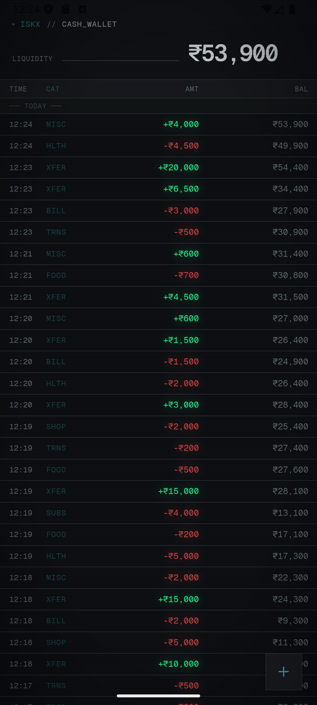
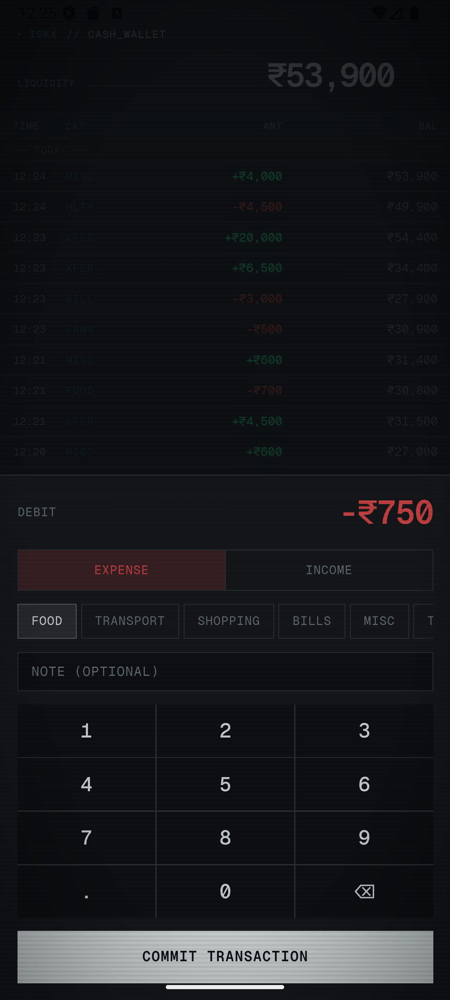
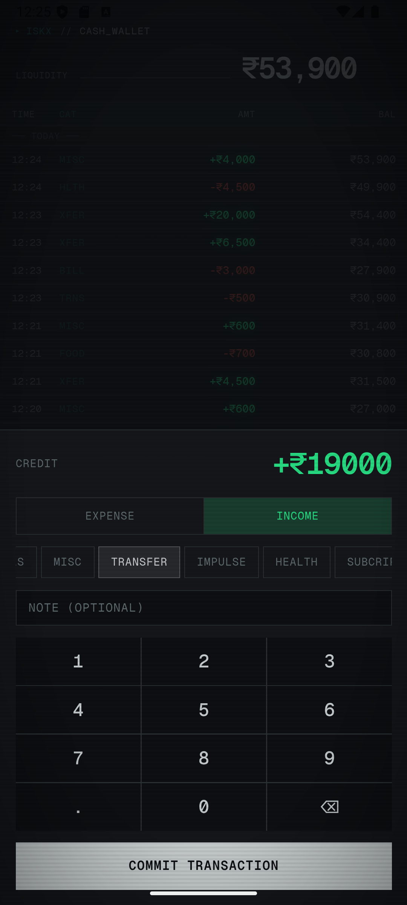

# ISKX - Ledger logger
A lightweight **"Fintech"** style personal finance tracker with number scramble animation built with Vite and packaged as an Android APK.

Track expenses, monitor balances, and organize transactions—all with a clean, minimal interface. Works offline. Data stored locally in your device.

  
  
  
    

## 🎯 Key Features
- Fast add/edit transactions
- Categorize and track spending
- Offline-capable for personal use
- Minimalistic, mobile-first UI
- Packaged as an APK for Android installation

## 💻 Tech Stack
- **Frontend:** Vite + React (TS/JS)
- **Bundler:** Vite
- **Mobile Packaging:** Capacitor for Android APK

## 💽 Installation

### APK file (Recommended)
1. Download the latest **.apk** from [Releases](https://github.com/happyman09/iskx/releases).

2. Install it.

3. If prompted, enable Install from Unknown Sources.

4. If prompted, complete scan from google play.

## License
All Rights Reserved.
You may use the app for personal purposes only.
Modifying, redistributing, or selling the app is **PROHIBITED**.
